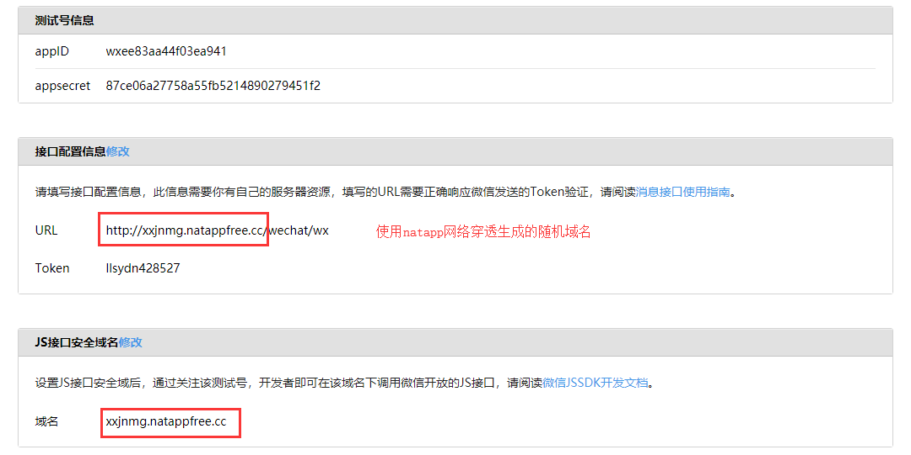
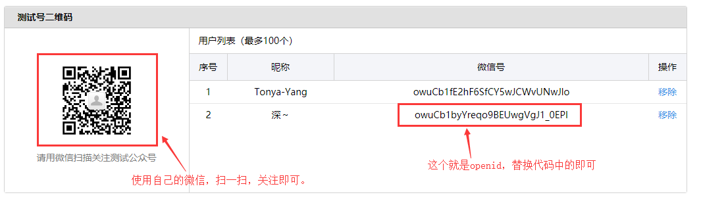

# wxSendAll
微信公众号发送图文信息的demo

项目说明：
本项目是使用springboot快速整合第三方框架
例如：spring，springmvc，thymeleaf等框架。

# 1.使用wx-tools
* 微信公众号开发的工具，提供了很多方法，可以快速的整合微信公众号开发。
* Wx-tools是基于微信公众平台API的轻量级框架。 基于Wx-tools你可以开速开发一个订阅号/服务号的web应用后台。
* 特性：
  > * (1)统一、简单的API，可以快速上手。
  > * (2)链式赋值编程，更加容易理解和使用。
  > * (3)对于微信服务器发来的消息，提供匹配器（Matcher），拦截器（interceptor），处理器（Handler）接口，定制实现，具有可扩展性。
* 具体api文档说明：https://www.w3cschool.cn/wxtools/

# 2.使用lombok
* 在项目中使用Lombok可以减少很多重复代码的书写。比如说getter/setter/toString等方法的编写。
* 安装：打开IDEA的Setting –> 选择Plugins选项 –> 选择Browse repositories –> 搜索lombok –> 点击安装 –> 安装完成重启IDEA –> 安装成功

# 3.使用jsoup
* 是一个用于处理真实HTML的Java库。它提供了一个非常方便的API，用于提取和操作数据，使用最好的DOM，CSS和类似jquery的方法。
* jsoup实现WHATWG HTML5规范，并将HTML解析为与现代浏览器相同的DOM。
  
  从URL，文件或字符串中刮取和解析 HTML
  使用DOM遍历或CSS选择器查找和提取数据
  操纵 HTML元素，属性和文本
  清除用户提交的内容以防止安全白名单，以防止XSS攻击
  输出整洁的HTML
  jsoup旨在处理野外发现的各种HTML; 从原始和验证到无效的标签汤; jsoup将创建一个合理的解析树。
* 使用jsoup处理字符串中img标签的src数据。

# 4.项目使用
* 拉取项目，使用idea打开，导入相关的依赖。
* 使用微信登录微信测试账号：https://mp.weixin.qq.com/debug/cgi-bin/sandbox?t=sandbox/login
* 修改：接口配置信息，URl（需要外网地址），Token（随便填）
* 修改：JS接口安全域名

备注：接口配置信息，需要外网地址，这里推荐使用natapp，进行网络穿透。
* natapp使用说明如下：
> https://natapp.cn
> https://natapp.cn/article/natapp_newbie

备注：接口配置信息，配置通过，还需要修改该项目的wx.properties的配置信息
> wx.appId=wxfdb7328443ded7d8（填写自己测试账号的appID）
> wx.appSecret=5ce8251850ace94e86f9cf71fa4d48dd（填写自己测试账号的appsecret）
> wx.token=llsydn428527（填写自己测试账号填写的Token）

修改这些配置后，重启项目，就可以进行接口配置信息的配置了。访问路径为：127.0.0.1/wechat/wx
因为微信需要访问到这个地址，所以要开启natapp将本地服务器进行网络穿透，使得微信服务器可以访问
到我们的地址，所以这里也要启动natapp生成随机域名：http://xxjnmg.natappfree.cc，
即访问地址：http://xxjnmg.natappfree.cc/wechat/wx

微信测试账号配置如下：

备注：这里需要自己关注测试号二维码（如下）

> 修改代码：
> * com.llsydn.wechat.service.impl.WechatServiceImpl的sendMessageToAll()方法（如下）
> * previewSender.setTouser("op5v856uhhacVQiDAkRrr1PQTE-k"); 这里换成自己的openid即可

* 群发微信图文信息的地址为：127.0.0.1/wechat/wx/sendall
* 如果配置好了的话，这里就可以实现群发微信图文信息的功能。
* 备注：微信测试账号，只能群发文本信息，不能群发图文信息，只能预览图文信息。

* 联系方法：QQ: 1091391667(如有问题可以联系该QQ)
